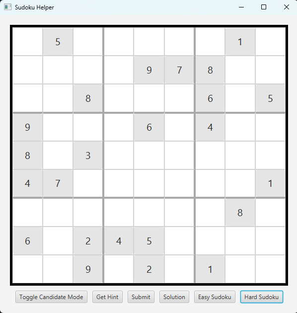
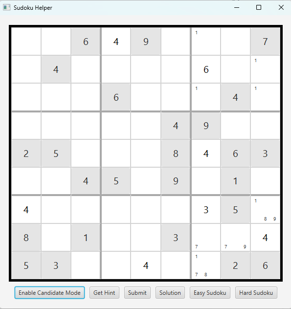
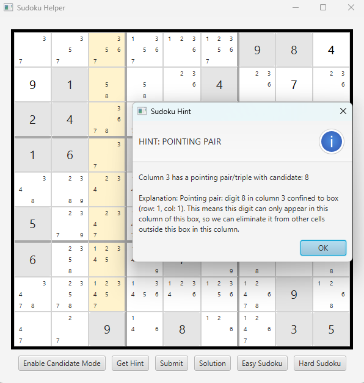
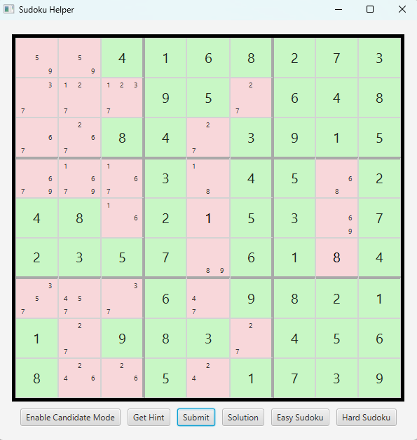
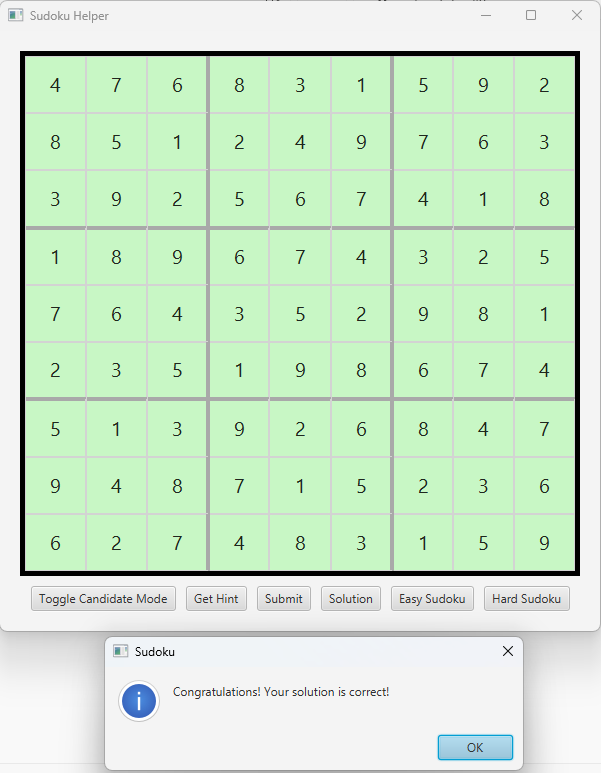

# Sudoku Helper

A Sudoku helper tool that:

- Generates puzzles of varying difficulty
  - Both the puzzle and its solution are generated using a backtracking algorithm
- Solves them step-by-step using human-style logic
- Provides interactive hints
- Can display the solution and check the user's inputs
- Features a modular solving and hint engine
- Includes a JavaFX GUI for an intuitive desktop experience
---
## Screenshots of the Application
## Generated 'Hard Sudoku'

## Supports Candidate Annotations

## Example of the Value Hints
Below is an example of the value hints provided by the hint engine. This one is for naked singles, which is the most basic hint strategy. (When a cell can only contain one value it can be filled in immediately with that value.)

## Example of the Candidate Hints
The hint engine also supports other hint strategies, such as hidden singles, naked pairs, hidden pairs, pointing pairs/triples, checking for mistakes, and revealing all candidate values on the board.
This is enough to solve all easy and intermediate puzzles (which is roughly 75% of the puzzles generated from the hard sudoku button).
Here is an example of a more complex hint, the pointing pair, with its explanation and result. It eliminates candidates from other cells if a certain criterion is met.
Note that the hints that allow the elimination of candidates are only applied after all candidates have been filled in, which can be provided by a hint as can be seen below.

 
## User Input Checking
At any time, the user can choose to submit their solution to check if what they have entered is correct. The correct ones will be in green, the wrong ones in red. They can then remove it and request hints if they are stuck.

## Displaying the Solution

## Features
- Modular solving and hint engine 
  - Built in a way that allows for easy extension of hint strategies, so that the hint engine can solve more complex puzzles. (Currently able to solve roughly 75% of the puzzles generated from difficult level)
- The hint engine provides step-by-step hints with brief explanations to justify each step
- JavaFX GUI for playing, solving, and learning Sudoku
- Difficulty levels: generate either easy or difficult sudoku puzzles

## Setup

### Running the Application

This project uses JavaFX for the client UI.

### Prerequisites

- JDK 17 or 21 installed (JavaFX requires JDK 11+ but not newer than 21 for best compatibility)
- JavaFX SDK 23.0.1 downloaded from [Gluon](https://gluonhq.com/products/javafx/)

### Running in IntelliJ IDEA

1. Download and unzip the JavaFX SDK.
2. Open **Run > Edit Configurations...**.
3. Select the run configuration for `SudokuHelperClient`.
4. In **VM options**, add the following (replace with your JavaFX SDK path):
--module-path /path/to/javafx-sdk-23.0.1/lib --add-modules javafx.controls,javafx.fxml

### Run Locally

To launch the JavaFX client, use your IDE or run the appropriate main class with the JavaFX module path. Or: